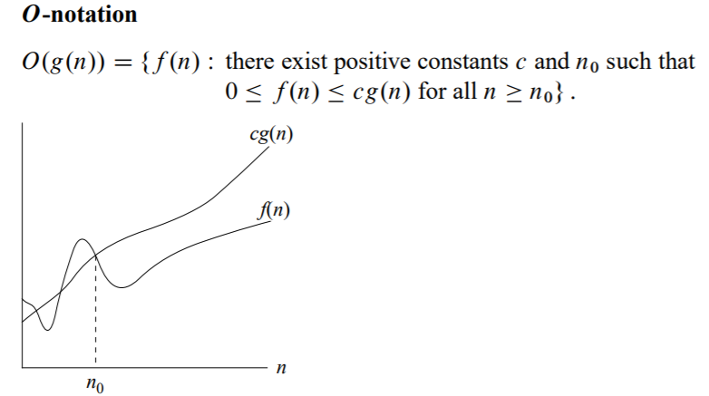
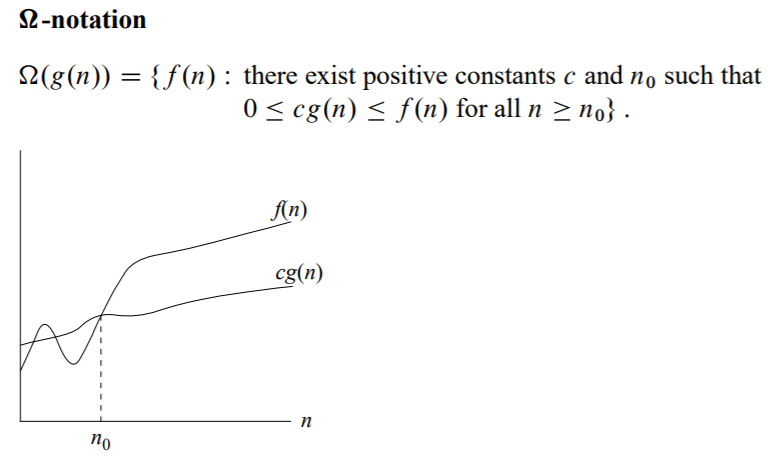
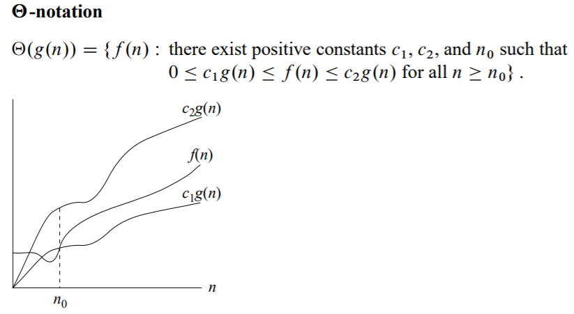
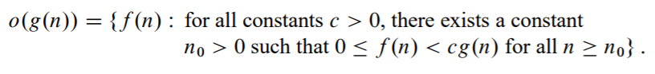
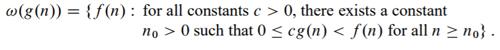

# 函数增长

本章是整本书的一个基础（后面介绍每一个算法都会着重于它的运行效率和时间复杂度，而用到的理论知识就是本章的内容），主要介绍一些表示运行时间的渐进符号、以及一些常用函数。

## 渐进符号

渐近记号用来描述算法的运行时间，定义域为自然数集 N = {0, 1, 2, ...}。  
本章主要使用五种符号：  
  

1. 大O表示法表示一个渐进上界

2. 大Ω表示法表示一个渐进下界

3. Θ表示渐进确界

4. 小o表示一个非紧确的上界

5. 小Ω表示一个非紧确的下界

